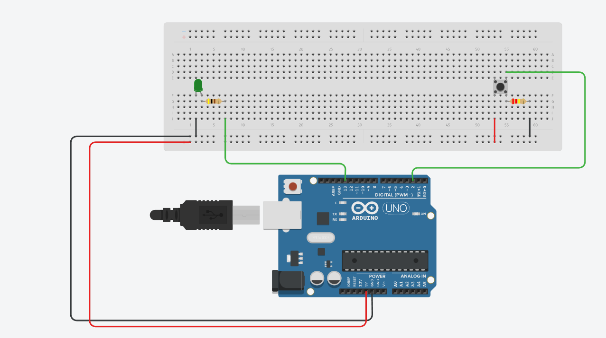

# Project 02 ( Led Blinking Using Push Button )
[Live-In-Production Demo](https://www.tinkercad.com/things/3H7wpXRHXDJ)_________________________________________ _Individual Project | Duration: 30 Minutes_  
- This is a basic Led Blinking using push button Project using Arduino.

## 👨‍💻 Tech Stack
Tech : `Arduino Programming` `Hardware`  

Tools : `Arduino IDE`

## 📝 I Learn
- How to connect electronic components to an Arduino board.
- How to write and upload code to an Arduino board.
- How to use digital input and output pins on an Arduino board.
- How to use a push button to control an LED.
- How to use conditional statements (if-else) in your code.

## ☑️ Working

To make an LED blink using a push button and an Arduino, you will need the following components:

- Arduino board
- Breadboard
- LED
- Push button
- Resistor (220 ohms)
- Jumper wires

Here are the steps to follow: anode

1. Connect the cathode (negative) leg to the ground (GND) pin on the Arduino and the anode (positive) leg to a 220 ohm resistor. Then connect the other end of the LED    to digital pin 13 on the Arduino. 

2. Connect one leg of the push button to digital pin 2 on the Arduino, and the other leg to the ground (GND) pin on the Arduino.

3. Connect one end of a jumper wire to the same row as the push button leg connected to digital pin 2. Connect the other end of this jumper wire to the 5V pin on the      Arduino.

4. Upload the code to your Arduino board:

5. Once you have uploaded the code, press and release the push button to turn the LED on and off.

That's it! Your LED should now blink when you press the push button.

## 📷 Screenshot

